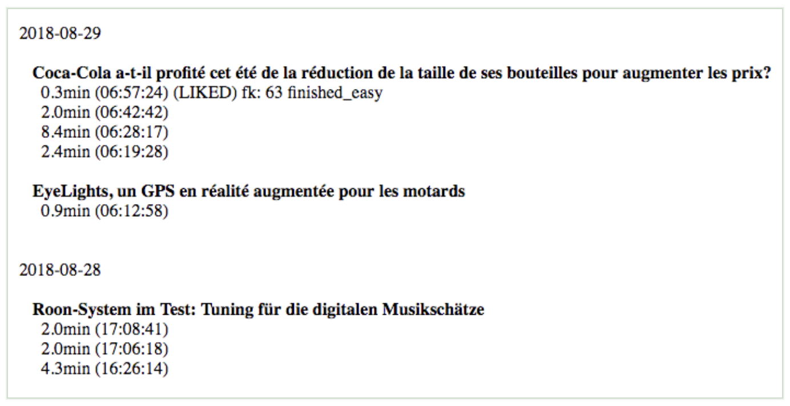

# A Performance Problem

*07 Sept, 2018*

## Setting the Stage

This is a story of finding and fixing a performance bug in one research project with the help of another research project.

In the first project, [Zeeguu](http://zeeguu.org) we research how we can make learning a foreign language more fun. We created a platform that monitors a learners interactions with foreign texts and based on these past interactions we recommend further personalized reading and vocabulary exercises.

The second project is [Flask Monitoring Dashboard](https://github.com/flask-dashboard/Flask-MonitoringDashboard/) (hereafter abbreviatred as FMD). It is an advanced internal monitor that tracks the evolution of performance and utilization of web applications. It can be **deployed with one line of code** in Flask-based apps and APIs. The main developers of the FMD are Bogdan Petre and Patrick Vogel, two of my past master students in Groningen.

In the long tradition of _eating your own dog food_ the FMD is used to monitor the performance evolution of the Zeeguu API.

## The Problem

Zeeguu aims to track the time spent by the learners reading articles by monitoring their interactions with the text in order to distill reading sessions – periods of time in which a reader is focused on reading.

Computing reading sessions is however not easy: users might leave an article open while chatting with their friends on WhatsApp or playing Farmville on their phone; this time should not be counted as reading time.

Trying to predict when the user stopped paying attention requires complicated heuristics that are based all the actions that a user performed while interacting with a text.

The figure below is a screenshot from the Zeeguu web app; it shows multiple reading sessions inferred based on my interactions with the Zeeguu reader yesterday and today.

If you look at the article titles. you see that today I read two French articles and yesterday I read a German one.

If you look at the session lengths, you see that this morning I was not very focused: it took me multiple sessions to read the article about the Coca Cola bottle size. It seems that I was not very focused on this article this morning, but rather interleaved reading with my other morning routines.




However, today I realized that there is a big problem with displaying of information about the user sessions in the Zeeguu web app; it is very very slow. Something like: 


## Using FMD Finding the Reason For the Slowness

The functionality for computing user sessions is implemented in an endpoint named `user_article_history`.

To find out why this endpoint is so slow, it’s very convenient to use the FMD. As mentioned before, the FMD is already deployed in the Zeeguu API and all we need to do is to enable **profiling** from its user interface.

When the profiler is enabled for an endpoint, for every call to that endpoint the FMD samples continuously the Python call stack such that it can present information about the lines of code where the most time was being spent.

We thus enable the profiler for `user_article_history`, make sure to call the endpoint one more time, then open the Profiler tab in FMD to discover the information presented in the figure below. The figure shows the time spent on the corresponding lines of code called from the endpoint.


The first line shows us that the endpoint was computing stuff for 43 seconds!

The last line shows that 98% of the time is spent in the following code line (which is not fully visible in the image):

```
cls.query.filter(UserActivityData.time < self.last_action_time).all()
```

This is Python code that uses SQLAlchemy. SQLAlchemy is a very powerful ORM which will convert this Python code to SQL and send the corresponding queries to a database management system (in our case MySQL). In theory we do not need to know MySQL if we use SQLAlchemy. In practice, because of something that Joel Spolsky calls [the law of leaky abstractions](https://www.joelonsoftware.com/2002/11/11/the-law-of-leaky-abstractions/), most of the times we still need to understand some details about MySQL anyway.

So we now know that the slowness of our endpoint is probably due to the SQL query that is generated by the SQLAlchemy code in the above-mentioned line. And we also know that, due to the SQLAlchemy naming conventions, the very slow SQL query must work with the `user_activity_data` table and its `time` column (this is given away by the `UserActivityData.time` part in the code above).

Looking at the table structure in the database and at the session computation algorithm we observe two things:

-   the table has not been designed with the session computation algorithm in mind, and the algorithm iterates many times through all the table rows
-   the `user_activity_data` table is a very large table with hundreds of thousands of records

## Improving Performance 

The first thing that comes to my mind is a recent discussion with my sister about DB indexes and how they are very powerful performance tools. So I’m thinking, maybe this is an opportunity to show with a case study the impact of an index.

I thus go to the database and I add a new index that is inspired by the `UserActivityData.time` that appears in the very slow code line above:

```
CREATE INDEX ... ON user_activity_data(time)
```

This will make MySQL create additional internal structures that will allow it to optimize queries that involve in their condition the `user_activity_data` table and the `time` column.

I redeploy the API, request again the endpoint and then I visit again the Profiler page, and lo and behold! Instead of 43 seconds now my endpoint takes 1.6 seconds.


I now have a nice example to show to my sister about the huge impact indexes have on database performance.

## Lessons Learned

**For the Beginner:** Indexes are very important for the performance of your database. Also, profiling the performance of your code is a skill you will have to learn. The FMD is a good starting point if you are a Flask developer.

**For the Intermediate:** An internal monitor for your API can be a wonderful and much faster way of getting insight into the workings of your service. Sure, you can also deploy a profiler from your development environment, but having the profiler available to be deployed in production with a single click has the huge advantage of you getting information about the **real** data.

**For the Advanced:** FMD can be deployed with [one line of Python code](https://github.com/flask-dashboard/Flask-MonitoringDashboard/). And being a research project, is also free. So try it out. In exchange we might ask you for feedback at some point. But hey, that’s nothing for the easy obtained valuable insights you get with it.